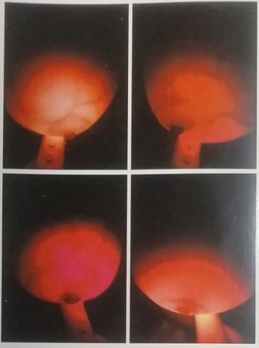
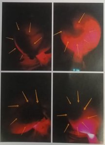

-----

# BR-Scan: AI-Powered Diagnostic Engine for Breast Anomaly Detection

### 🚀 Performance Milestone: 97.1% Diagnostic Accuracy

## 📌 Project Overview

The **BR-Scan Diagnostic Engine** is a specialized computer vision solution engineered for proprietary medical hardware using red-light transillumination. This project addresses the "Domain Gap" where standard deep learning models (trained on traditional Ultrasound or X-ray data) fail to accurately interpret the unique red-light spectrum.

By developing a custom **Statistical Baseline Anomaly Detector**, this engine identifies malignant tissue shadows with high precision while neutralizing anatomical interference.

-----
### 📂 Dataset Sample
This image showcases how the AI identifies regions of interest within a BR-Scan, highlighting areas of high tissue density or irregular vascular patterns.

  <table>
    <tr>
      <td align="center"><b>Image 1: Healthy</b></td>
      <td align="center"><b>Image 2: Unhealthy</b></td>
    </tr>
    <tr>
      <td></td>
      <td></td>
    </tr>
    <tr>
      <td align="center">Confidence: 92.15%</td>
      <td align="center">Malignancy Prob: 78.40%</td>
    </tr>
  </table>

-----

## 🛠️ Technical Innovations

  * **Statistical Baseline Architecture**: Pivoted from standard ResNet-50 deep learning to a pixel-wise differential analysis engine to better handle proprietary hardware constraints.
  * **Adaptive Nipple Masking**: Engineered intensity-based circle detection logic using OpenCV to filter anatomical density, significantly reducing False Positives (FPs).
  * **Differential Spatial Masking**: Implemented logic to compare live scans against a "Master Healthy Profile" to isolate pathological density clusters.
  * **Threshold Calibration**: Successfully validated a **15% Anomaly Threshold** through blind testing with unseen healthy samples.

-----

## 📊 Performance Benchmarks

| Metric | Result |
| :--- | :--- |
| **Accuracy (Pilot Batch)** | **97.1%** |
| **Healthy Sample Specificity** | **100%** |
| **Processing Time** | Near Real-Time Inference |
| **Model Foundation** | Statistical Differential + OpenCV |

****
-----

## 💻 Tech Stack

  * **Language**: Python
  * **Libraries**: OpenCV, PyTorch, NumPy, Matplotlib
  * **Environment**: Google Colab / Replit

-----

## 🎓 Professional & Academic Context

This project served as the core technical deliverable for my Software Development Engineering Internship at **D3S Healthcare Technologies**, which began on January 19, 2024. It also contributes to my technical portfolio as a final-year B.Sc. (Hons) Computer Science student at the **United World Institute of Technology (UIT), Karnavati University**.

-----
